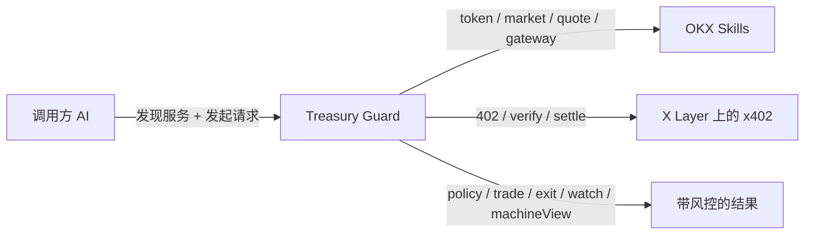

# Agent Treasury Guard

[English](./README.md) | [简体中文](./README.zh-CN.md)

[](./package.json)
[](./docs/live-proof.md)
[](./SKILL.md)

**Built on OKX Skills, sold as AI decision workflows**

Agent Treasury Guard 是一个建立在 OKX Skills 之上的 AI 决策工作流产品。  
OKX 提供底层链上技能，Treasury Guard 把它们组织成 AI 愿意付费的决策工作流。其他 AI 不必自己拼 OKX Skills，就能直接购买带风控的链上决策与执行结果。

当 Treasury Guard 以托管服务方式部署时，调用方 AI 不需要自己申请 OKX Market / Trade 凭证，也不需要自己重做那套链上编排。运营方只需要把 OKX 适配层和收款链路配置一次，下游 AI 就可以通过 `manifest + OpenAPI + x402` 直接购买结果。



## 快速入口

- [工作流能力层](./SKILL.md)
- [接口契约](./openapi.yaml)
- [总架构图](./docs/architecture.md)
- [叙事插图](./docs/article-visuals-zh.md)
- [价值主张](./docs/longform-intro-zh.md)
- [项目简介](./docs/project-summary-zh.md)
- [Live 证明](./docs/live-proof.md)
- [证据台账](./docs/workflow-evidence.md)

## 一句话理解

如果把 OKX Skills 看成底层链上积木，那么 Treasury Guard 就是把这些积木组织成 AI 可直接购买的成品工作流。

它卖的不是单点数据接口，而是：

- `policy`: 该不该做
- `trade`: 怎么入场
- `exit`: 怎么退场
- `watch`: 后续怎么盯
- `machineView`: 其他 AI 如何继续调用

## 为什么不是直接拼 OKX Skills

OKX Skills 已经让其他 AI 可以直接使用 `token / market / quote / gateway`。  
但问题是，调用方 AI 仍然需要自己：

- 手工编排多个技能
- 自己补风险约束
- 自己决定入场和退出
- 自己定义监控条件
- 自己处理支付与结果解锁

Treasury Guard 解决的是这一层问题：把底层链上技能升级成可直接购买的决策工作流。

## 为什么它具备可复制性

Treasury Guard 的可复制性分成两层：

- 调用方复用：其他 AI 通过 `GET /manifest`、`openapi.yaml` 和标准 `402 -> X-PAYMENT -> 解锁` 流程，直接消费高阶工作流
- 运营方复用：团队把 OKX 适配层、支付链路和 merchant 配置一次，然后让多个下游 AI 复用同一套控制层

这就是我们真正的复制逻辑：

- OKX Skills 负责底层能力
- Treasury Guard 负责工作流层
- 调用方 AI 复用工作流，不再重复建设整套 OKX 接入和风控编排

## 调用方与运营方的边界

### 对调用方 AI

调用方 AI 不需要自己：

- 申请 OKX Market / Trade 凭证
- 把 `token / market / quote / gateway` 拼成完整流程
- 重做 Treasury Policy
- 自己设计 entry / exit / watch
- 自己实现 x402 的 verify / settle 处理

调用方只需要：

- 一个 Treasury Guard 服务地址
- `GET /manifest`
- `openapi.yaml`
- 能遵循标准 `402 -> X-PAYMENT -> 解锁` 流程

### 对运营方

运营方仍然需要做一次性配置：

- 选择分析适配层：`mock`、`onchainos-cli` 或 `okx-http`
- 配置 merchant 和 x402 支付参数
- 视情况接入 `real-wallet` 或外部 signer
- 决定是否启用白名单 Provider 的 `20% / 80%` 分成

所以 Treasury Guard 不是消灭全部配置，而是把配置收敛到服务层，避免每个调用方都重复做一遍。

## Hosted Mode 与 Self-Hosted Mode

| 模式 | 适合谁 | 谁来配置 OKX 与 x402 | 调用方 AI 需要什么 | 取舍 |
| --- | --- | --- | --- | --- |
| Hosted Treasury Guard | 想快速让多个下游 AI 复用同一套工作流的团队 | Treasury Guard 运营方一次性配置适配层、merchant 和支付链路 | `manifest`、`openapi.yaml`、以及标准 `402 -> X-PAYMENT -> 解锁` 调用流程 | 接入最快，但调用方依赖托管服务 |
| Self-hosted Treasury Guard | 想自己掌握整套运行环境的团队 | 部署方在自己的环境里配置适配层、merchant 和 signer | 本地运行环境、环境变量、merchant 配置，以及可选 signer 设置 | 控制力更高，但部署和维护成本更高 |

## 最小接入示例

最小的调用流程只有 5 步：

1. 发现服务
2. 请求 premium workflow
3. 收到 `402 Payment Required`
4. 附带 `X-PAYMENT` 重试
5. 取回解锁后的结构化结果

发现服务：

```bash
curl http://127.0.0.1:8788/manifest
```

请求 thesis plan：

```bash
curl -X POST http://127.0.0.1:8788/premium/thesis-plan \
  -H "content-type: application/json" \
  -d '{
    "symbol": "BRETT",
    "chain": "base",
    "side": "buy",
    "budgetUsd": 1000,
    "riskProfile": "balanced",
    "thesis": "Momentum and whale support still justify a guarded entry.",
    "thesisSource": "external-ai"
  }'
```

如果没有附带支付头，服务会先返回 `402` 和 `paymentRequirements`。  
第一次返回大致是这样：

```json
{
  "error": "payment-required",
  "message": "Attach X-PAYMENT to unlock this workflow.",
  "paymentRequirements": [
    {
      "scheme": "exact",
      "network": "xlayer",
      "asset": "USDT"
    }
  ]
}
```

调用方完成签名并附带 `X-PAYMENT` 重试后，就能拿到包含以下字段的结果：

- `policy`
- `decision`
- `execution`
- `watch`
- `machineView`

解锁后的结果刻意保持为紧凑结构：

```json
{
  "decision": {
    "action": "proceed",
    "confidence": "medium"
  },
  "policy": {
    "status": "pass"
  },
  "execution": {
    "route": "best-quote"
  },
  "watch": {
    "nextReviewInMinutes": 15
  },
  "machineView": {
    "nextCall": "track-execution"
  }
}
```

## 核心能力

- `Free Opportunity Scan`
  先免费给 shortlist 和下一步 premium call 提示
- `Premium Trade Plan`
  带 Treasury Policy 的入场计划
- `Premium BYO Thesis Plan`
  让其他 AI 带着自己的 thesis 来买验证与执行方案
- `Premium Exit Plan`
  带分批减仓、清仓和 watch 规则的退出方案

## 商业模式

- `House workflows`
  Treasury Guard 自营判断层直接收费
- `Direct BYO Thesis`
  普通 AI 自带 thesis，直接购买 Treasury Guard 的验证服务
- `Provider workflows`
  白名单 Provider thesis 才进入 `20% / 80%` 分成

## 技术与支付

- 分析层支持：
  - `mock`
  - `onchainos-cli`
  - `okx-http`
- x402 支付层支持：
  - `mock-x402`
  - `okx-x402-api`
- 目前支持 `X Layer` 上的：
  - `USDG`
  - `USDT`
  - `USDC`

## 快速开始

```bash
cd agent-treasury-guard
npm test
npm run preflight
npm run premium:demo
npm run premium:live-demo-thesis
```

## 关键命令

```bash
npm run preflight
npm run premium:live-smoke
npm run premium:real-payment-thesis-smoke
npm run premium:live-demo-thesis
npm run premium:live-demo-trade
```

## 最适合先看的材料

如果你第一次看这个项目，建议按这个顺序：

1. [长文介绍](./docs/longform-intro-zh.md)
2. [长文插图](./docs/article-visuals-zh.md)
3. [Live 证明](./docs/live-proof.md)
4. [证据台账](./docs/workflow-evidence.md)
5. [技能说明](./SKILL.md)
6. [OpenAPI 契约](./openapi.yaml)

## 当前边界

- `offchain-ledger` 仍是 Provider 分成的当前结算方式，不是链上自动 split
- live 证明目前覆盖 thesis 主链路，trade / exit 保留为历史 live 记录，后续可继续补跑
