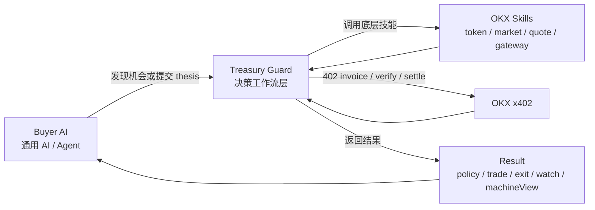

# Agent Treasury Guard Architecture

## Layers

- Buyer AI: a generic agent that does not want to manually orchestrate OKX Skills.
- Treasury Guard: the paid decision-workflow layer that adds policy, trade, exit, and watch.
- OKX Skills: the base onchain capabilities for token, market, quote, and gateway actions.
- OKX x402: the payment rail for request -> invoice -> verify -> settle -> unlock.
- Result: a machine-consumable guarded output, not just raw market data.

## Why This Matters

- The buyer AI does not reconstruct token search, risk scoring, quote routing, or order tracking.
- Treasury Guard sits above OKX Skills instead of replacing them.
- The A2A contract is explicit: discover via `/manifest`, invoice via `402`, unlock via `X-PAYMENT`.
