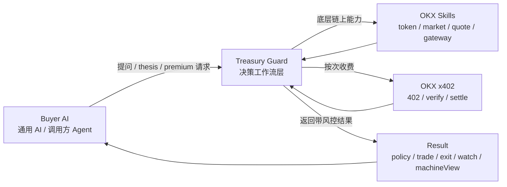
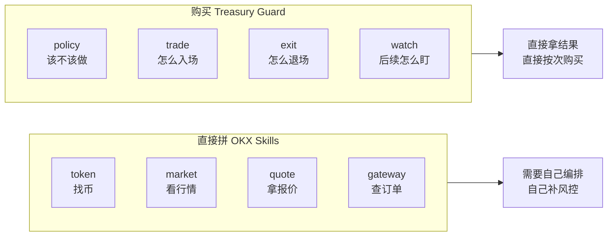

# 长文插图

这页给长文、路演稿、公众号或 X 长帖直接复用。
两张图都尽量压成一屏，读者一眼就能看懂 Treasury Guard 到底做了什么。

## 图 1：总架构图

建议标题：
`Treasury Guard 在 AI 与 OKX Skills 之间加了一层可付费的决策工作流`

建议图注：
`OKX 提供底层链上技能，Treasury Guard 把它们封装成 AI 可直接购买的决策工作流。`

配文可直接使用：

- Buyer AI 不需要自己拼 token、market、quote、gateway。
- Treasury Guard 负责 policy、trade、exit、watch 和 machineView。
- 支付通过 x402 完成，结果在验证和结算后再解锁。

## 图 2：为什么不直接拼 OKX Skills

建议标题：
`为什么其他 AI 不直接自己拼 OKX Skills，而要购买 Treasury Guard`

建议图注：
`OKX Skills 解决“能做什么”，Treasury Guard 解决“该不该做、怎么做、什么时候退出”。`

配文可直接使用：

- 左边是底层技能，强但分散。
- 右边是决策工作流，直接给 AI 可执行结果。
- 调用方 AI 不是为原始数据付费，而是为带约束的决策结果付费。

## 用法建议

长文里建议这样插：

1. 开头先放“图 1：总架构图”
2. 讲到“为什么不用直接拼 OKX Skills”时放“图 2：对照图”
3. 后面再接真实支付、真实结算和 `live-proof.md`

相关材料：

- [architecture.md](./architecture.md)
- [live-proof.md](./live-proof.md)
- [project-summary-zh.md](./project-summary-zh.md)
