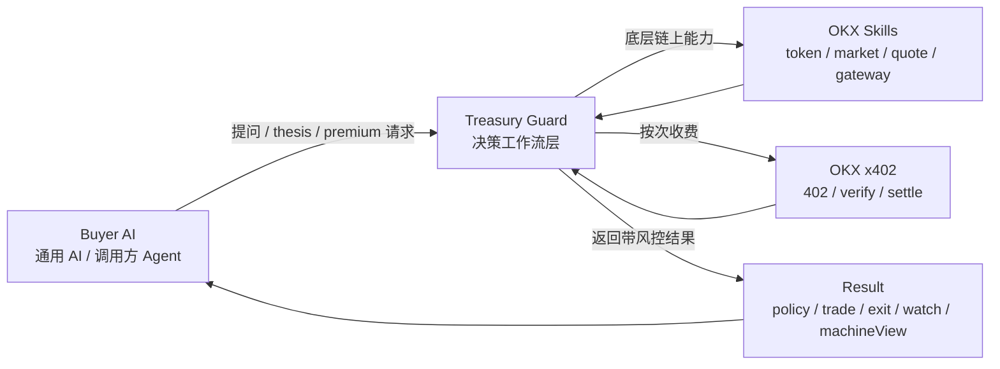
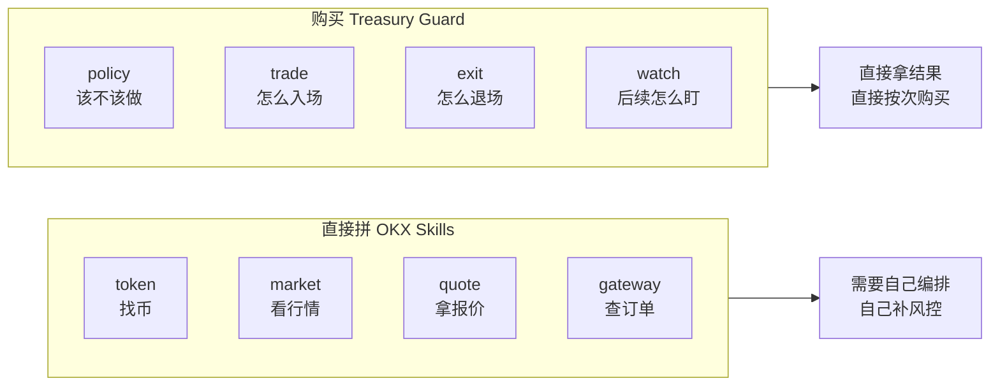

# Agent Treasury Guard：把 OKX Skills 变成 AI 可直接购买的决策工作流

## 先说结论

我们做的不是一个新的聊天机器人，也不是一个简单包装了行情接口的 Web3 Agent。

**OKX 提供底层链上技能，Treasury Guard 提供 AI 愿意付费的决策工作流。**  
**其他 AI 不必自己拼 OKX Skills，就能直接购买带风控的链上决策与执行结果。**

这就是 `Agent Treasury Guard` 的核心定义。

项目入口：

- [English README](../README.md)
- [中文 README](../README.zh-CN.md)
- [技能说明](../SKILL.md)
- [OpenAPI 契约](../openapi.yaml)
- [Live 证明](./live-proof.md)

## 为什么这个方向成立

OKX 已经做了一件很重要的事：它把很多链上能力做成了 Skills，其他 AI 可以很快接入。

这件事解决了“能不能接”，但没有完全解决“接进来以后怎么用”。

调用方 AI 依然要面对几个真实问题：

1. 它知道可以调 `token / market / quote / gateway`，但不知道怎么把这些底层技能拼成一个稳定结果。
2. 它拿到了报价和数据，却没有一套一致的 `policy / trade / exit / watch` 逻辑。
3. 它能得到信息，却得不到一个可直接继续调用的标准化 `machineView`。
4. 它能调用工具，却不一定能把高价值结果做成按次收费的服务。

Treasury Guard 要解决的，就是这一层缺口。

## 一张图看懂整体结构

图注：  
**OKX 提供底层链上技能，Treasury Guard 把它们封装成 AI 可直接购买的决策工作流。**

## 为什么其他 AI 不直接自己拼 OKX Skills

这不是因为 OKX Skills 不好，恰恰相反，是因为它们做得足够底层、足够通用。

但越底层、越通用，就越意味着：

- 你要自己编排
- 你要自己补风控
- 你要自己定义决策边界
- 你要自己做支付和结果解锁

所以真正的对比不是“OKX 和 Treasury Guard 谁更强”，而是：

- `OKX Skills` 解决底层能力
- `Treasury Guard` 解决成品工作流

这张图最适合说明这件事：

图注：  
**OKX Skills 解决“能做什么”，Treasury Guard 解决“该不该做、怎么做、什么时候退出”。**

## Treasury Guard 到底卖什么

它卖的不是单点 API 调用，而是四类成品结果：

### 1. Free Opportunity Scan

先免费给调用方 AI 一个 shortlist。  
这样其他 AI 可以先发现候选，再决定是否购买更高价值的 workflow。

### 2. Premium Trade Plan

当调用方真的想买入时，Treasury Guard 返回的不是价格，而是：

- Treasury Policy
- 风险判断
- 路由建议
- 执行步骤
- Watch Plan

### 3. Premium BYO Thesis Plan

如果其他 AI 已经有自己的 thesis，它不需要放弃自己的判断层。  
它只需要把 thesis 交给 Treasury Guard，让后者去做：

- live 数据验证
- Treasury Policy 审核
- route / execution
- exit / watch
- x402 收费

### 4. Premium Exit Plan

大多数系统喜欢讲入场，但真正值钱的是退出。  
Treasury Guard 把退出做成一等公民，输出：

- 减仓 / 清仓建议
- 分批退出 clips
- 继续观察的 watch 条件

## 这和普通 Agent 有什么本质不同

普通 Agent 更像：

- 会聊天
- 会解释
- 会调几个工具

Treasury Guard 更像：

- 决策工作流层
- 风控守门层
- A2A 付费服务层

它的重点不是“模型有多聪明”，而是：

- 结果够不够稳定
- 规则够不够清楚
- 输出能不能直接给其他 AI 继续消费

## 商业模式为什么成立

这里的关键不是“向用户收费”，而是“向其他 AI 收费”。

对调用方 AI 来说，付费理由很明确：

- 不用自己拼 OKX Skills
- 不用自己补风控
- 不用自己维护 entry / exit / watch 逻辑
- 不用自己定义统一输出结构

所以它不是为“原始数据”付费，而是为“带约束的决策结果”付费。

## BYO Thesis 和 Provider 分成不是一回事

这一点我们专门做了严格区分。

### 普通 BYO Thesis

- 普通 AI 自带 thesis
- 直接向 Treasury Guard 购买验证与执行服务
- 不走分成

### Approved Provider Thesis

- 只有白名单 Provider
- 带完整 `providerId + providerName + providerPayoutAddress`
- 才进入 `20% / 80%` 分成

这意味着：

- 普通 AI 可以直接用
- 强 Provider 也可以接进来变现
- 但 Treasury Guard 仍然掌握最终风控和执行层

## 为什么这更像 OKX 会喜欢的方向

因为它不是试图替代 OKX，而是站在 OKX Skills 之上做生态层创新。

它保留了 OKX 的基础设施价值：

- token
- market
- swap
- gateway
- x402

同时把这些能力升级成：

- 可购买
- 可编排
- 可复用
- 可被其他 AI 接入

这比做一个面向人类用户的“会聊天的交易机器人”，更像基础设施生态里的一层。

## 真实验证已经做到哪里

这不是一个只停留在概念上的项目。

我们已经做了：

- live `okx-http` 分析
- live `okx-x402-api` verify / settle
- real wallet payer
- thesis / trade / exit 多条真实支付链路

最直接的证明看这里：

- [Live 证明页](./live-proof.md)

## GitHub 里最值得看的内容

如果别人进到 GitHub 仓库，我建议按这个顺序看：

1. [中文 README](../README.zh-CN.md)
2. [技能说明](../SKILL.md)
3. [OpenAPI 契约](../openapi.yaml)
4. [总架构图与对照图](./article-visuals-zh.md)
5. [Live 证明](./live-proof.md)

## 最后一句话

**OKX 提供底层链上技能，Treasury Guard 提供 AI 愿意付费的决策工作流。**  
**其他 AI 不必自己拼 OKX Skills，就能直接购买带风控的链上决策与执行结果。**
